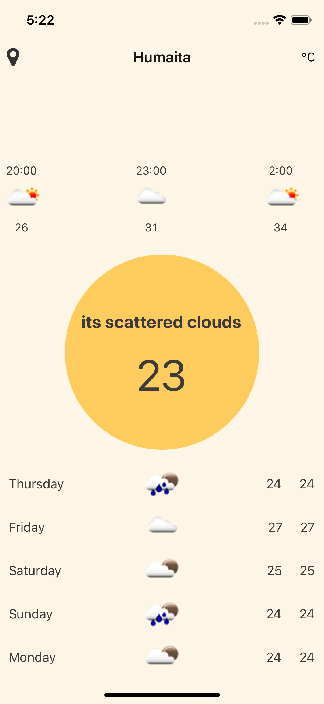
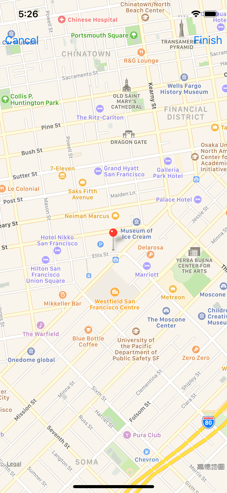

# XDWeather_react_native

create weather app by react native

 

## Installation
```sh
# clone the project and cd into it
git clone git@github.com:Flaque/quirk.git; cd ./XDWeather_react_native

# install dependencies
npm install

# start development environment
react-native run-ios
```
